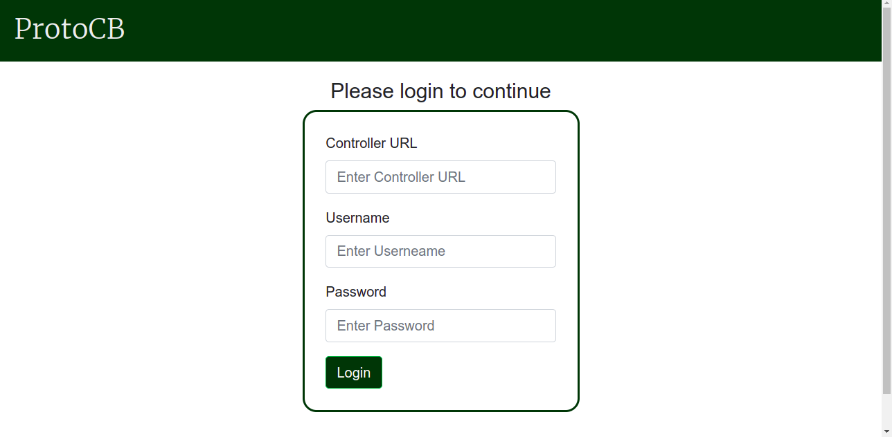
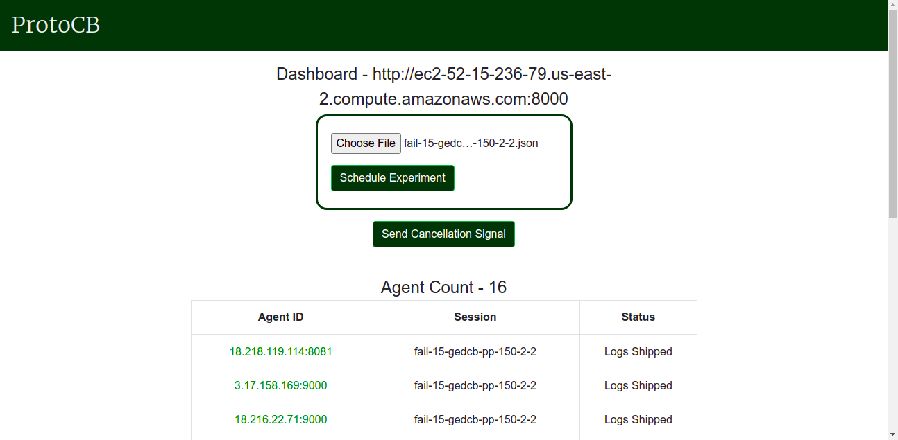

# ProtoCB Dashboard

Dashboard for connecting to a <a href="https://github.com/ProtoCB/controller">ProtoCB Controller</a> and scheduling experiments on ProtoCB. One can connect to the controller by entering the controller URL, username and password that were configured while deploying the controller. Progress of experiments can also be tracked using the dashboard. The dashboard is implemented using ReactJS and this repository holds the code for the same.

## Dashboard Connection UI

 

## ProtoCB Experimentation UI
